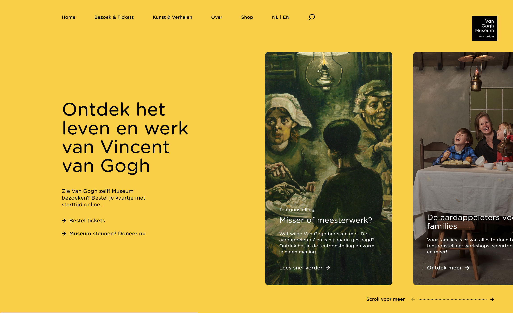

# Procesverslag
Markdown is een simpele manier om HTML te schrijven.  
Markdown cheat cheet: [Hulp bij het schrijven van Markdown](https://github.com/adam-p/markdown-here/wiki/Markdown-Cheatsheet).

Nb. De standaardstructuur en de spartaanse opmaak van de README.md zijn helemaal prima. Het gaat om de inhoud van je procesverslag. Besteedt de tijd voor pracht en praal aan je website.

Nb. Door *open* toe te voegen aan een *details* element kun je deze standaard open zetten. Fijn om dat steeds voor de relevante stuk(ken) te doen.

## Jij

uitwerken voor kick-off werkgroep

### Auteur:
Danique Lammertink

#### Je startniveau:
Rood

#### Je focus:
Responsive
 

## Je website

uitwerken voor kick-off werkgroep

### Je opdracht:
https://www.vangoghmuseum.nl/nl

#### Screenshot(s) van de eerste pagina (small screen): 
Homepage 

Ik was de screenshot die ik in het begin had gemaakt kwijt, dus inmiddels is er al een ander artikel als eerste... 

#### Screenshot(s) van de tweede pagina (small screen):
Shop 

 

## Breakdownschets (week 1)

uitwerken na afloop 2e werkgroep

### de hele pagina: 

### dynamisch deel (bijv menu): 

## Voortgang 1 (week 2)

uitwerken voor 1e voortgang

### Stand van zaken
Ik begon best wel goed en was erg enthousiast. De website die ik heb gekozen leek mij erg leuk om te doen, dit omdat ik sinds ik weet dat Van Gogh ooit bestaan heeft, ik fan ben van hem. Daarnaast leek de website mij niet al te moeilijk, dit vond ik belangrijk omdat ik voor het eerst een responsive website zou maken.

### Agenda voor meeting
samen met je groepje opstellen

| student 1      |
| ---            |
|responsive maken|
| hoe ik de fotos|
| het beste kan aanpakken           |

### Verslag van meeting
Ik was als enige bij de feedback ronde, dus had genoeg tijd om mijn eigen vragen te stellen. Ik heb wel contact gehad met mijn groep maatje, maar hij had het druk.

## Voortgang 2 (week 3)

uitwerken voor 2e voortgang

### Stand van zaken
Door een tekort aan tijd wegens een ander vak had ik niet heel veel vorderingen sinds vorige week, maar ik liep wel al tegen wat punten aan. Ik wil een responsive website, en de display flex werkt niet mee. 

### Agenda voor meeting
samen met je groepje opstellen

| student 1      | student 2          | 
| ---            | ---                | 
| display flex   | responsive         | 
| van de images  |                    | 
| ...            | ...                | 

### Verslag van meeting
Mijn groepmaatje kwam pas na een kwartier in de feedback sessie, dus ik had al mijn vragen al behandelt toen hij aankwam. Deze keer had ik een gesprek met de studentassistenten en hun konden mij goed helpen met mijn vragen. Mijn display flex werkt nu eindelijk wel en dit is een grote stap in mijn website. Hij lijkt al bijna op de echte versie.

## Toegankelijkheidstest (week 4)

uitwerken na test in 8e voortgang

### Bevindingen
- De taal van mijn website stond op engels dus hij las alles in het engels voor.
- Ik heb de a states nog niet gedaan in css.

#### Titel eerste bevinding
De taal stond in het engels

Ik was vergeten om in de head de taal aan te passen naar NL.

#### Titel tweede bevinding. 
DDe a states moeten nog uitgewerkt worden.

Ik was dit simpelweg vergeten.

## Voortgang 3 (week 4)

uitwerken voor 3e voortgang

### Stand van zaken
Mijn code is bijna af, maar nog erg rommelig. Door een eerder gesprek met een studentassistent  heb ik dan ook besloten om de website opnieuw op te bouwen zodat het overzichtelijker is. 

### Agenda voor meeting
samen met je groepje opstellen

| student 1      |         
| ---            |
| responsive!!!  |
| scroll position? |
|                 |

### Verslag van meeting
Je verwacht het niet, maar ik zat weer in mijn eentje in deze meeting. Ik heb het hier met Sanne gehad over hoe mijn website in elkaar zit. Het is nog steeds erg rommelig, maar we hebben der beide vertrouwen in dat het goedkomt. 

## Eindgesprek (week 5)

uitwerken voor eindgesprek

### Stand van zaken
Ik vind zelf dat ik het redelijk goed heb gedaan, als ik er meer tijd voor had gehad was hij sowieso beter gehad, maar door een andere grote deadline kwam ik in de knoop met de tijd. Gelukkig kan ik dit ook zien als een leermoment. Ik moet in de toekomst beter plannen bijvoorbeeld. Ook is het handig om de breakdownschetsen er gewoon bij te houden. Want ik was eigenlijk alweer vergeten dat ik die had gemaakt en als ik ze nu naast mijn code houd zat ik er nog al naast met die schetsen.

We zijn weer een aantal weken verder en ik heb alles opnieuw gemaakt. Ik had het erg druk de afgelopen weken en eigenlijk stelde ik FED ook heel erg uit. Ik zat er echt tegen op om die shop te maken, omdat hij me heel moeilijk leek. Uiteindelijk ben ik er toch maar "gewoon" aan begonnen. Ik kwam erachter dat met simpel nadenken je erg ver komt en voor mij is dit dan ook het hoogst haalbare op het moment.

### Screenshot(s)

hier screenshot(s) van je eindresultaat

## Bronnenlijst

continu bijhouden terwijl je werkt

Nb. Wees specifiek ('css-tricks' als bron is bijv. niet specifiek genoeg).

1. https://css-tricks.com/snippets/css/a-guide-to-flexbox/
2. https://codetogo.io/how-to-listen-to-scroll-event-in-javascript/
3. https://codepen.io/daveredfern/pen/zBGBJV

